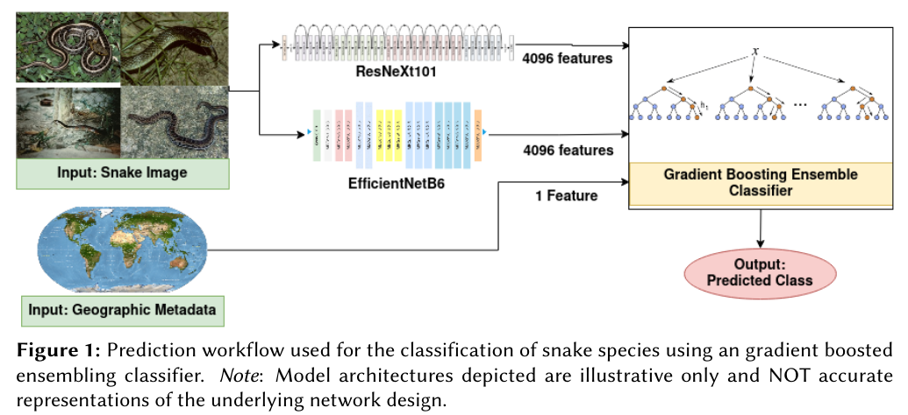

# SnakeCLEF: Gradient Boosting for the Visual Classification of Fungi Species, 2022

Scripts, figures and working notes for the participation in [SnakeCLEF 2022](https://www.imageclef.org/SnakeCLEF2022), part of the [LifeCLEF labs](https://www.imageclef.org/LifeCLEF2022) at the [13th CLEF Conference, 2022](https://clef2022.clef-initiative.eu/index.php).

## Quick Links

The following references will help in reproducing this implementation and to extend the experiments for further analyses.

- [Manuscript [PDF]](https://ceur-ws.org/Vol-3180/paper-173.pdf)
- [Model Training Scripts](./Scripts/train)
- [Concept and Dataset Description](https://www.imageclef.org/SnakeCLEF2022)

## Cite Us

[Link to the Research Paper](https://ceur-ws.org/Vol-3180/paper-173.pdf)

If you find our work useful in your research, don't forget to cite us:

```
@article{palaniappan2022deep,
  url = {https://ceur-ws.org/Vol-3180/paper-173.pdf},
  title={Deep Learning and Gradient Boosting Ensembles for Classification of Snake Species},
  author={Palaniappan, Mirunalini and Desingu, Karthik and Bharathi, Haricharan and Chodisetty, Eeswara Anvesh and Bhaskar, Anirudh},
  keywords={Ensemble Learning, Convolutional Neural Networks, Gradient Boosting Ensemble, Metadata-aided Classification, Image Classification, Transfer Learning},
  journal={Conference and Labs of the Evaluation Forum},
  publisher={Conference and Labs of the Evaluation Forum},
  year={2022},
  ISSN={1613-0073},  
  copyright = {Creative Commons Attribution 4.0 International}
}
```

## Key Highlights

### Proposed Prediction Workflow

- Each *observation* in the dataset is made up of numerous fungus photos and its contextual geographic information like nation, exact area where the photograph was taken on four layers, along with specific attributes like substrate and habitat. 
- Each image in an observation is preprocessed before being fed through the two feature extraction networks to generate two 4096-element-long representation vectors. - These vectors are combined with numeric encoded nation, location at three-level precision, substrate, and habitat metadata for the image to produce a final vector with a size of 8198. 
- The boosting ensemble classifier is fed all the 8198 features to generate a probability distribution over all potential fungi species classes. 

This workflow is depicted below,   


### Conclusions and Future Scope

- The ensembling approach was found to be an effective option for applying to data-intensive and high-complexity image classification tasks that are commonly released at LifeCLEF. 
- The inclusion of contextual information showed a strong impact on the classification results — the F1-scores for the best models improved from 61.72% and 41.95% to 63.88% and 42.74%.
- We further conjecture that training the individual models to convergence, and subsequently applying the boosting ensembler with
hyperparameter tuning will culminate in a superior prediction performance, that exhausts the proposed architectures’ and methodology’s potential. 
- In addition, approaches involving input image resolution variations, usage of alternative pre-trained weights [[A. Joly et al.](https://link.springer.com/chapter/10.1007/978-3-030-58219-7_23)], as well as the inclusion of custom training layers to the frozen base model when transfer learning [[M. Zhong et al.](https://www.sciencedirect.com/science/article/abs/pii/S0003682X20304795)] can greatly improve the quality of feature extraction. 
